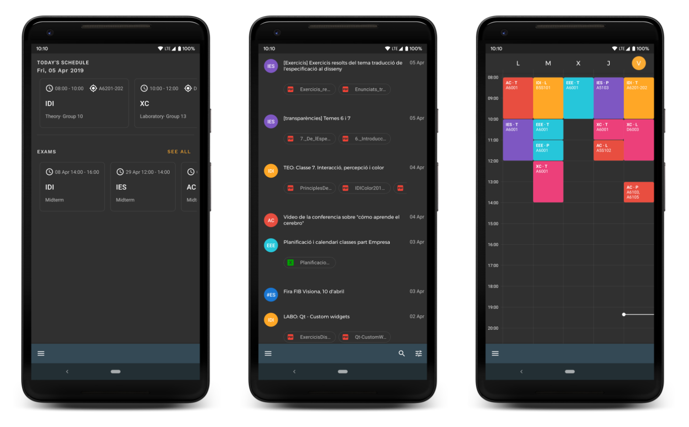

# Raco

<!---->

**An unofficial Android client for [El Racó](http://raco.fib.upc.edu)**.

_The app is currently in development._

### Features

- Publications
- Exams information
- Week schedule
- Subjects information
- Grades system

### Specs/Open-source libraries

The app has been developed using the [official API](https://api.fib.upc.edu/)

- [**MVVM architecture**](https://developer.android.com/jetpack/docs/guide)
- [**Material components**](https://github.com/material-components/material-components-android) for the UI
- [**Android Architecture Components**](https://developer.android.com/topic/libraries/architecture/) for building the architecture
- [**RxJava2**](https://github.com/ReactiveX/RxJava) & [**RxAndroid**](https://github.com/ReactiveX/RxAndroid) for Retrofit & background threads
- [**Retrofit**](https://github.com/square/retrofit) for constructing the REST API
- [**Dagger**](https://github.com/google/dagger) for dependency injection
- [**ButterKnife**](https://github.com/JakeWharton/butterknife) for view binding
- [**Glide**](https://github.com/bumptech/glide) for loading images
- [**Lottie**](https://github.com/airbnb/lottie-android) for animations

### Contribution

I'm open for any contribution you would like to do either by [_creating a PR_](https://github.com/VictorBG/RacoFib/compare), [_submitting an issue_](https://github.com/VictorBG/RacoFib/issues/new) on Github or proposing ideas to make the app better.

You can see the [current features](https://github.com/VictorBG/RacoFib/projects/1) that are being developed at the time and contribute to one. Note that the _In Progress_ features are actively being developed and won't accept any PR until they are finished. 

### Developed By

- Víctor Blanco
- [victorblancogarcia.com](https://victorblancogarcia.com)

### License
    Copyright 2019 VictorBG

     Licensed under the Apache License, Version 2.0 (the "License");
     you may not use this file except in compliance with the License.
     You may obtain a copy of the License at

         http://www.apache.org/licenses/LICENSE-2.0

     Unless required by applicable law or agreed to in writing, software
     distributed under the License is distributed on an "AS IS" BASIS,
     WITHOUT WARRANTIES OR CONDITIONS OF ANY KIND, either express or implied.
     See the License for the specific language governing permissions and
     limitations under the License.
     
